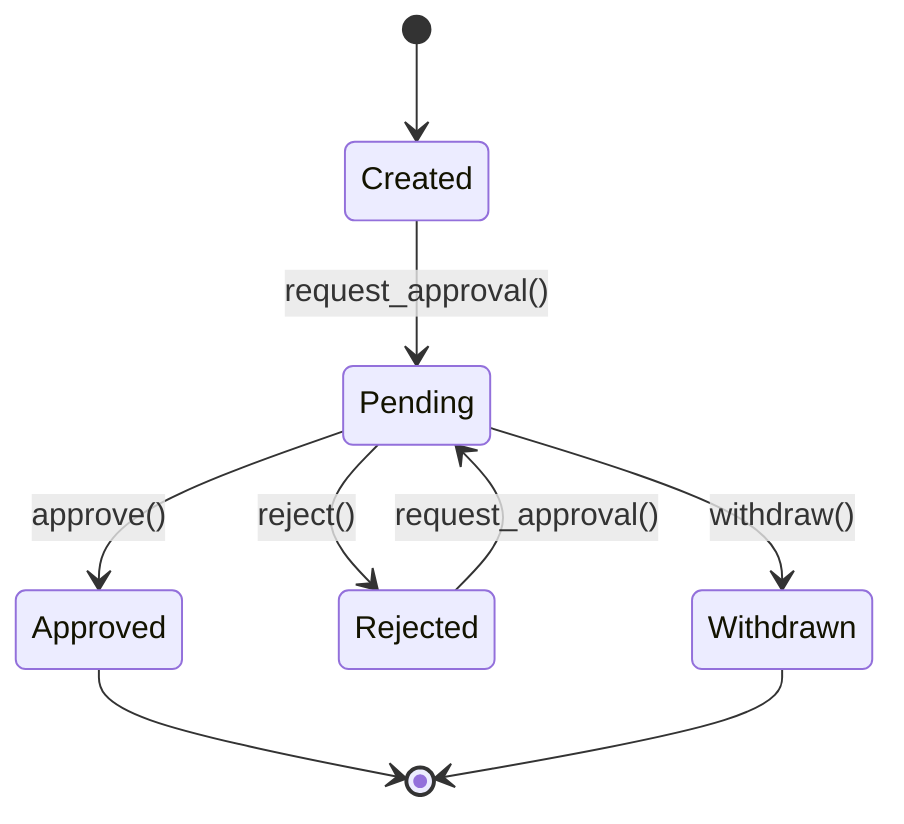

# Approval Workflow

## Metadata

- **Name**: Approval Workflow
- **Type**: Capability
- **System**: IntentR
- **Component**: Capability Service / Web UI
- **ID**: CAP-673286
- **Owner**: Development Team
- **Status**: Implemented
- **Approval**: Approved
- **Priority**: High
- **Analysis Review**: Not Required

## Business Context

### Problem Statement
Capabilities and enablers require formal approval before progressing through development stages. Without an approval workflow, there are no quality gates, and items can be implemented without proper review or authorization.

### Value Proposition
Implements a structured approval process with role-based permissions, ensuring capabilities are properly reviewed and authorized before implementation, reducing rework and maintaining quality standards.

### Success Metrics
- All capability stage transitions require explicit approval
- Clear visibility of pending approvals for approvers
- Complete audit trail of approval decisions
- Rejection feedback captured and actionable

## User Perspective

### Primary Persona
Product Owners and Administrators who need to review and approve capabilities before they progress to the next development stage.

### User Journey (Before/After)
**Before**: Capabilities can be created and updated freely with no approval gates, risking unauthorized or poorly-reviewed implementations.
**After**: Capabilities require approval at each stage gate, with clear visibility of pending items and decision history.

### User Scenarios
1. **Request Approval**: Engineer completes capability analysis and requests approval to proceed to design phase.
2. **Approve Request**: Product Owner reviews pending approval, examines the capability, and clicks "Approve".
3. **Reject with Feedback**: Admin rejects a capability design with specific feedback about what needs improvement.
4. **View Approval Queue**: Product Owner opens Approval Queue page to see all pending approvals assigned to their role.

## Boundaries

### In Scope
- Approval states: pending, approved, rejected, withdrawn
- Role-based approval permissions (who can approve)
- Approval request with optional notes
- Rejection with mandatory feedback
- Approval history per capability
- Pending approvals queue page
- Capability editing disabled during pending approval

### Out of Scope
- Multi-level approval chains
- Approval timeouts/escalation
- Email/push notifications
- Change-based approvals (per-field)
- Approval delegation

### Assumptions
- Single approval required per stage transition
- Role-based (not user-specific) approval authority
- Requesters cannot approve their own requests

### Constraints
- Binary approval model (single approver per request)
- No approval timeout mechanism
- Capability locked during pending state

## Enablers

| ID | Name | Purpose | Status |
|----|------|---------|--------|
| ENB-673298 | Approval Data Model | Database schema and Go models for approvals | Implemented |
| ENB-673299 | Approval Repository | Database operations for approval CRUD | Implemented |
| ENB-673300 | Approval API Endpoints | REST endpoints for approval operations | Implemented |
| ENB-673301 | ApprovalContext | React Context for approval state management | Implemented |
| ENB-673302 | ApprovalQueue Page | Admin page listing pending approvals | Implemented |
| ENB-673303 | ApprovalSection Component | Approval UI within capability forms | Implemented |
| ENB-673304 | ApprovalStatusBadge | Visual indicator for approval state | Implemented |

## Dependencies

### Internal Upstream Dependency
| Capability ID | Description |
|---------------|-------------|
| CAP-729481 | Authentication - User identity for approval tracking |
| CAP-673285 | Role Based Access Control - Role determines approval authority |
| CAP-318652 | Capability Management - Capabilities are the approval targets |

### Internal Downstream Impact
| Capability ID | Description |
|---------------|-------------|
| None | Terminal capability |

## Acceptance Criteria
- [ ] Capabilities can have approval status: pending, approved, rejected, withdrawn
- [ ] Users can request approval for a capability with optional notes
- [ ] Authorized roles (Admin, Product Owner) can approve pending requests
- [ ] Rejections require feedback/reason
- [ ] Requesters can withdraw pending requests
- [ ] Approval Queue page shows all pending approvals
- [ ] Capability forms disabled when approval is pending
- [ ] Approval history visible for each capability
- [ ] ApprovalStatusBadge displays current state with visual indicator

## Technical Specifications

### Approval State Machine



### Database Schema

```sql
CREATE TABLE capability_approvals (
  id SERIAL PRIMARY KEY,
  capability_id INTEGER NOT NULL REFERENCES capabilities(id),
  status VARCHAR(50) NOT NULL DEFAULT 'pending',
  requested_by INTEGER NOT NULL REFERENCES users(id),
  approved_by INTEGER REFERENCES users(id),
  rejection_reason TEXT,
  approval_notes TEXT,
  requested_at TIMESTAMP DEFAULT CURRENT_TIMESTAMP,
  approved_at TIMESTAMP,
  created_at TIMESTAMP DEFAULT CURRENT_TIMESTAMP,
  updated_at TIMESTAMP DEFAULT CURRENT_TIMESTAMP
);
```

### API Endpoints

| Method | Endpoint | Description |
|--------|----------|-------------|
| POST | /approvals/request | Request approval for a capability |
| GET | /approvals/pending | Get all pending approvals |
| POST | /approvals/{id}/approve | Approve a request |
| POST | /approvals/{id}/reject | Reject with feedback |
| POST | /approvals/{id}/withdraw | Withdraw a request |
| GET | /capabilities/{id}/approvals | Get approval history |

### Role Permissions

| Role | Can Request | Can Approve | Can Reject |
|------|-------------|-------------|------------|
| Administrator | Yes | Yes | Yes |
| Product Owner | Yes | Yes | Yes |
| Designer | Yes | No | No |
| Engineer | Yes | No | No |
| DevOps | Yes | No | No |

## Design Artifacts
- Full analysis in docs/features/approval/APPROVAL_WORKFLOW_ANALYSIS.md
- Implementation summary in docs/features/approval/APPROVAL_IMPLEMENTATION_SUMMARY.md

## Approval History

| Date | Stage | Decision | By | Feedback |
|------|-------|----------|-----|----------|
| 2025-12-23 | Discovery | Approved | System | Created from docs analysis |
