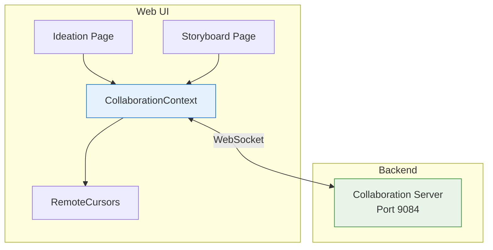

# Real-Time Collaboration

## Metadata

- **Name**: Real-Time Collaboration
- **Type**: Capability
- **System**: IntentR
- **Component**: Web UI
- **ID**: CAP-673284
- **Owner**: Development Team
- **Status**: Implemented
- **Approval**: Approved
- **Priority**: High
- **Analysis Review**: Not Required

## Business Context

### Problem Statement
Teams need to collaborate in real-time on ideation and storyboarding activities. Without real-time collaboration, users must coordinate externally, wait for others to finish, or risk overwriting each other's work.

### Value Proposition
Enables simultaneous multi-user editing with live cursor tracking, instant grid synchronization, and presence awareness, reducing coordination overhead and improving team productivity.

### Success Metrics
- Real-time cursor updates visible within 100ms
- Grid changes synchronized within 500ms
- Support for 10+ concurrent users per workspace
- Zero data conflicts through synchronized updates

## User Perspective

### Primary Persona
Product teams (designers, engineers, product owners) working together on ideation and storyboarding sessions.

### User Journey (Before/After)
**Before**: Users must take turns editing, coordinate via external chat, and manually refresh to see others' changes.
**After**: Multiple users can edit simultaneously, see each other's cursors in real-time, and all changes are instantly synchronized.

### User Scenarios
1. **Cursor Tracking**: User A moves their cursor on the ideation page, User B sees User A's cursor with their initials displayed in real-time.
2. **Grid Sync**: User A adds a text block, User B immediately sees the new block appear without refreshing.
3. **Presence Awareness**: User joins a workspace and sees a list of other active users currently in the workspace.

## Boundaries

### In Scope
- Real-time cursor position tracking with user identification
- Grid synchronization for ideation and storyboard pages
- User presence indicators (join/leave notifications)
- WebSocket-based communication
- Workspace-scoped collaboration rooms

### Out of Scope
- Offline mode / sync when reconnected
- Operational transformation (OT) or CRDTs for conflict resolution
- Video/audio calls
- In-app chat/messaging
- Version history and session replay

### Assumptions
- Users have stable network connections
- Workspaces have reasonable user counts (< 50 concurrent)
- Collaboration server is running on port 9084

### Constraints
- Client-side only cursor throttling for performance
- Full grid state broadcast (not deltas) on changes
- Single collaboration server instance (not clustered)

## Enablers

| ID | Name | Purpose | Status |
|----|------|---------|--------|
| ENB-673290 | Collaboration Server | WebSocket server for real-time communication | Implemented |
| ENB-673291 | CollaborationContext | React Context for collaboration state management | Implemented |
| ENB-673292 | RemoteCursors Component | Renders remote user cursors with identification | Implemented |
| ENB-673293 | Grid Synchronization | Broadcasts and receives grid updates | Implemented |

## Dependencies

### Internal Upstream Dependency
| Capability ID | Description |
|---------------|-------------|
| CAP-931847 | Workspace Management - Provides workspace context for room isolation |

### Internal Downstream Impact
| Capability ID | Description |
|---------------|-------------|
| None | Terminal capability |

## Acceptance Criteria
- [ ] Users can see other users' cursor positions in real-time with initials displayed
- [ ] Grid changes (add/edit/delete blocks) are synchronized within 500ms
- [ ] User presence list shows all active users in the workspace
- [ ] Join/leave notifications appear when users enter/exit
- [ ] Connection status indicator visible to users
- [ ] Collaboration is scoped to individual workspaces (room isolation)

## Technical Specifications

### Architecture

### Key Events

| Event | Direction | Description |
|-------|-----------|-------------|
| `join-workspace` | Client → Server | User joins a workspace room |
| `cursor-move` | Client → Server | User cursor position update |
| `grid-update` | Client → Server | Grid change broadcast |
| `cursor-update` | Server → Client | Remote cursor position |
| `user-joined` | Server → Client | User joined notification |
| `user-left` | Server → Client | User left notification |

### Data Flow

1. User action (cursor move, block add)
2. Component handler captures event
3. CollaborationContext broadcasts via WebSocket
4. Server broadcasts to all users in workspace room
5. Other clients receive and update local state

## Design Artifacts
- Architecture diagram in docs/REALTIME_COLLABORATION.md

## Approval History

| Date | Stage | Decision | By | Feedback |
|------|-------|----------|-----|----------|
| 2025-12-23 | Discovery | Approved | System | Created from docs analysis |
