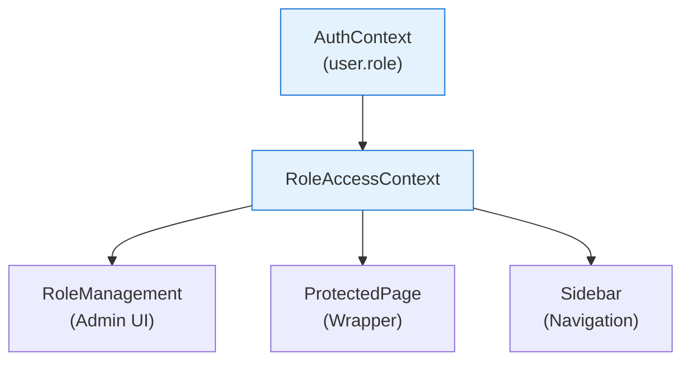

# Role Based Access Control

## Metadata

- **Name**: Role Based Access Control
- **Type**: Capability
- **System**: IntentR
- **Component**: Web UI / Auth Service
- **ID**: CAP-673285
- **Owner**: Development Team
- **Status**: Implemented
- **Approval**: Approved
- **Priority**: High
- **Analysis Review**: Not Required

## Business Context

### Problem Statement
Different team roles require different levels of access to application pages and features. Without proper access control, sensitive pages are exposed to all users, and administrators cannot customize permissions for their organization.

### Value Proposition
Provides granular page-level access control based on user roles, allowing organizations to enforce security policies and tailor the UI experience to each role's responsibilities.

### Success Metrics
- 5 predefined role types covering all team functions
- 3 access levels (Edit, View, Hidden) for flexible control
- Administrators can configure role permissions without code changes
- Navigation automatically filters based on user permissions

## User Perspective

### Primary Persona
System administrators who need to control which pages and features are accessible to different team members.

### User Journey (Before/After)
**Before**: All users see all pages, potentially accessing sensitive admin functionality or irrelevant features.
**After**: Users only see pages relevant to their role, with appropriate edit/view permissions enforced.

### User Scenarios
1. **Role Restriction**: A Designer role user cannot access the Admin Panel - the page is hidden from navigation.
2. **View-Only Access**: An Engineer can view the Designs page but cannot make modifications.
3. **Admin Configuration**: An Administrator changes DevOps role permissions to have edit access to Integrations.

## Boundaries

### In Scope
- 5 predefined role types (Product Owner, Designer, Engineer, DevOps, Administrator)
- 3 access levels (Edit, View, Hidden)
- Page-level permission configuration
- Navigation filtering based on permissions
- Role management admin UI
- Role mapping from authentication system

### Out of Scope
- Custom role creation
- Permission inheritance hierarchies
- API endpoint protection (backend validation)
- Audit logging for permission changes
- Field-level permissions within pages

### Assumptions
- Users have exactly one role assigned
- Role definitions stored in localStorage (client-side)
- Auth service provides role in JWT claims

### Constraints
- Client-side enforcement only (server should validate for production)
- No custom role creation - fixed 5 role types
- Role definitions reset on localStorage clear

## Enablers

| ID | Name | Purpose | Status |
|----|------|---------|--------|
| ENB-673294 | RoleAccessContext | React Context providing role-based permissions | Implemented |
| ENB-673295 | RoleManagement Component | Admin UI for configuring role permissions | Implemented |
| ENB-673296 | ProtectedPage Component | Wrapper enforcing page-level access control | Implemented |
| ENB-673297 | Sidebar Role Filtering | Filters navigation based on user permissions | Implemented |

## Dependencies

### Internal Upstream Dependency
| Capability ID | Description |
|---------------|-------------|
| CAP-729481 | Authentication - Provides user role from JWT claims |

### Internal Downstream Impact
| Capability ID | Description |
|---------------|-------------|
| CAP-673286 | Approval Workflow - Uses roles to determine who can approve |

## Acceptance Criteria
- [ ] 5 role types available: Product Owner, Designer, Engineer, DevOps, Administrator
- [ ] Each page can be set to Edit, View, or Hidden for each role
- [ ] Hidden pages do not appear in navigation
- [ ] View-only pages show read-only indicator
- [ ] Edit pages allow full interaction
- [ ] Administrator can access Role Management interface
- [ ] Role configurations persist in localStorage

## Technical Specifications

### Role Types

| Role | Description | Default Access |
|------|-------------|----------------|
| Product Owner | Manages product vision, requirements, priorities | Full access except Admin Panel |
| Designer | Designs user interfaces and experiences | Edit most pages, Admin Panel hidden |
| Engineer | Implements features and maintains code quality | View most pages, Edit Capabilities/System |
| DevOps | Manages infrastructure, deployments, operations | Edit Integrations/Settings, View others |
| Administrator | Full system access and user management | Full edit access to all pages |

### Access Levels

| Level | Icon | Behavior |
|-------|------|----------|
| Edit | ✏️ | Full read/write access |
| View | 👁️ | Read-only, form elements disabled |
| Hidden | 🚫 | Page not visible in navigation |

### Component Architecture



### API Interface

```typescript
interface RoleAccessContextType {
  canAccess(path: string): boolean;
  getAccessLevel(path: string): 'edit' | 'view' | 'hidden';
  isPageVisible(path: string): boolean;
  isPageEditable(path: string): boolean;
}
```

## Design Artifacts
- Full documentation in docs/ROLE_BASED_ACCESS_CONTROL.md

## Approval History

| Date | Stage | Decision | By | Feedback |
|------|-------|----------|-----|----------|
| 2025-12-23 | Discovery | Approved | System | Created from docs analysis |
