# Interactive Storyboard Canvas

## Metadata

- **Name**: Interactive Storyboard Canvas
- **Type**: Enabler
- **ID**: ENB-942158
- **Approval**: Approved
- **Capability ID**: CAP-944623
- **Owner**: Product Team
- **Status**: Implemented
- **Priority**: High
- **Analysis Review**: Required
- **Code Review**: Not Required

## Technical Overview
### Purpose
Create an interactive canvas with drag-and-drop flow boxes and connecting lines for visual storyboard editing in the design-driven development workflow.

## Functional Requirements

| ID | Name | Requirement | Priority | Status | Approval |
|----|------|-------------|----------|--------|----------|
| | | | | | |

## Non-Functional Requirements

| ID | Name | Type | Requirement | Priority | Status | Approval |
|----|------|------|-------------|----------|--------|----------|
| | | | | | | |

## Dependencies

### Internal Upstream Dependency

| Enabler ID | Description |
|------------|-------------|
| ENB-836247 | Workspace Management |
| ENB-597324 | State Management System |

### Internal Downstream Impact

| Enabler ID | Description |
|------------|-------------|
| | |

### External Dependencies

**External Upstream Dependencies**: None identified.

**External Downstream Impact**: None identified.

## Technical Specifications

### UI Layout

The Storyboard Canvas follows the application-wide UI consistency pattern:
- Action buttons (Analyze & Generate, Add Card, UI Assets) are positioned in the page header row via PageLayout's `actions` prop
- Buttons are right-justified on the same line as the title
- Responsive behavior: buttons wrap to next line on narrow screens rather than being clipped

### Responsive Button Visibility

**Implementation Note**: The PageHeader component was updated to remove `overflow: hidden` from `.page-header__title-row`, ensuring that action buttons remain visible when the browser window is resized. Buttons will wrap to the next line on narrow screens via `flex-wrap: wrap` rather than disappearing.

### Enabler Dependency Flow Diagram

```mermaid
flowchart TD
    ENB_942158["ENB-942158<br/>Interactive Storyboard Canvas<br/>📡"]

    classDef enabler fill:#e3f2fd,stroke:#1976d2,stroke-width:2px
    class ENB_942158 enabler
```

