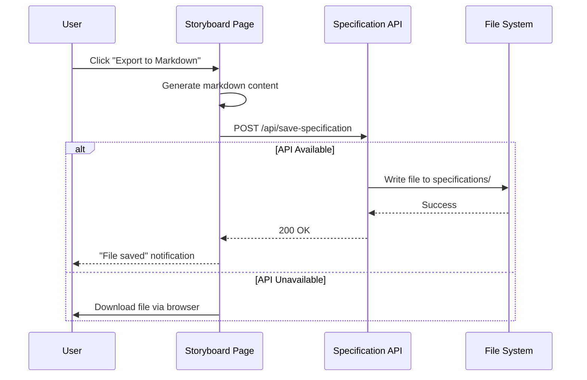

# Markdown Export

## Metadata

- **Name**: Markdown Export
- **Type**: Enabler
- **ID**: ENB-673305
- **Capability ID**: CAP-759314
- **Owner**: Development Team
- **Status**: Implemented
- **Approval**: Approved
- **Priority**: Medium
- **Analysis Review**: Not Required
- **Code Review**: Not Required

## Technical Overview

### Purpose

Provides functionality to export storyboard content to markdown format, generating detailed specification documents that can be saved to the specifications folder or downloaded by the user.

### Architecture Fit

This enabler is part of the Storyboard capability and integrates with:
- Specification API Server for file saving
- Storyboard page for export trigger
- WorkspaceContext for workspace metadata

## Functional Requirements

| ID | Name | Requirement | Priority | Status | Approval |
|----|------|-------------|----------|--------|----------|
| FR-673305-001 | Export Button | Provide "Export to Markdown" button in Storyboard header | High | Implemented | Approved |
| FR-673305-002 | Markdown Generation | Generate comprehensive markdown from story cards | High | Implemented | Approved |
| FR-673305-003 | Mermaid Diagrams | Include mermaid flowchart showing card connections | High | Implemented | Approved |
| FR-673305-004 | File Save API | Save markdown files to specifications/ folder via API | High | Implemented | Approved |
| FR-673305-005 | Fallback Download | Download file to browser if API server unavailable | Medium | Implemented | Approved |
| FR-673305-006 | Metadata Inclusion | Include timestamp, workspace name, card count in export | Medium | Implemented | Approved |

## Non-Functional Requirements

| ID | Name | Requirement | Type | Status | Priority | Approval |
|----|------|-------------|------|--------|----------|----------|
| NFR-673305-001 | Export Speed | Export should complete within 2 seconds for typical storyboards | Performance | Implemented | Medium | Approved |
| NFR-673305-002 | File Naming | Files named as storyboard-{workspace}-{date}.md | Usability | Implemented | High | Approved |

## Technical Specifications

### Export Process Flow



### Generated Markdown Structure

```markdown
# Storyboard: {Workspace Name}

## Metadata
- **Generated**: {timestamp}
- **Workspace**: {workspace name}
- **Total Cards**: {count}
- **Connections**: {count}

## Overview
{Summary text}

## Flow Diagram
\`\`\`mermaid
flowchart TD
    card1["✓ Card Title"]
    card2["⟳ Another Card"]
    card1 --> card2
\`\`\`

## Story Cards

### 1. {Card Title}
**Status**: {status}
**Description**: {description}
**Flows to**: {connected cards}
**Comes from**: {source cards}

---

## Technical Specifications
- Total user interaction points: {count}
- Flow complexity: {connections}
- Completion status: {stats}
```

### API Integration

| Operation | Endpoint | Payload | Response |
|-----------|----------|---------|----------|
| Save Specification | POST /api/save-specification | { filename, content, workspace } | { success, path } |
| Health Check | GET /api/health | None | { status: 'ok' } |

### Status Icons

| Status | Icon | Mermaid Syntax |
|--------|------|----------------|
| Completed | ✓ | `["✓ Title"]` |
| In Progress | ⟳ | `["⟳ Title"]` |
| Pending | ○ | `["○ Title"]` |

### Implementation Files

- `web-ui/server.js` - Express.js API server on port 4001
- `web-ui/src/pages/Storyboard.tsx` - Export button and generation logic
- `specifications/` - Target directory for saved files

## Edge Cases and Error Handling

| Scenario | Expected Behavior | Test Case |
|----------|-------------------|-----------|
| API server not running | Fallback to browser download | Test with server stopped |
| Empty storyboard | Generate minimal markdown with zero counts | Export with no cards |
| Cards without connections | Flow diagram shows isolated nodes | Export unconnected cards |
| Special characters in titles | Properly escaped in markdown | Cards with quotes, brackets |

## Acceptance Scenarios (Gherkin)

### Test Suite: TST-673305 - Markdown Export Tests

```gherkin
@TST-673305
Feature: Storyboard Markdown Export
  As a user
  I want to export my storyboard to markdown
  So that I can save specifications or share the flow documentation

  Background:
    Given I am logged in
    And I have a workspace with a storyboard

  @TS-673306 @FR-673305-001 @critical
  Scenario: Export storyboard with API available
    Given the Specification API server is running
    And I have 3 story cards with 2 connections
    When I click the "Export to Markdown" button
    Then a markdown file should be saved to specifications/
    And a success notification should appear
    And the filename should match "storyboard-{workspace}-{date}.md"

  @TS-673307 @FR-673305-005
  Scenario: Export storyboard with API unavailable
    Given the Specification API server is not running
    And I have story cards on the storyboard
    When I click the "Export to Markdown" button
    Then a file download should be triggered in the browser
    And the downloaded file should contain valid markdown

  @TS-673308 @FR-673305-003
  Scenario: Mermaid diagram generation
    Given I have cards "Login" and "Dashboard" with a connection
    When I export to markdown
    Then the markdown should contain a mermaid flowchart
    And the flowchart should show "Login --> Dashboard"
```

### Test Scenario Summary

| Scenario ID | Name | Requirement | Priority | Status | Automation |
|-------------|------|-------------|----------|--------|------------|
| TS-673306 | Export with API | FR-673305-001 | Critical | Ready | Automated |
| TS-673307 | Export fallback | FR-673305-005 | High | Ready | Automated |
| TS-673308 | Mermaid diagram | FR-673305-003 | Medium | Ready | Automated |

## Implementation Reference

Full documentation in docs/features/MARKDOWN_EXPORT_FEATURE.md

## Approval History

| Date | Stage | Decision | By | Feedback |
|------|-------|----------|-----|----------|
| 2025-12-23 | Discovery | Approved | System | Created from docs analysis |
