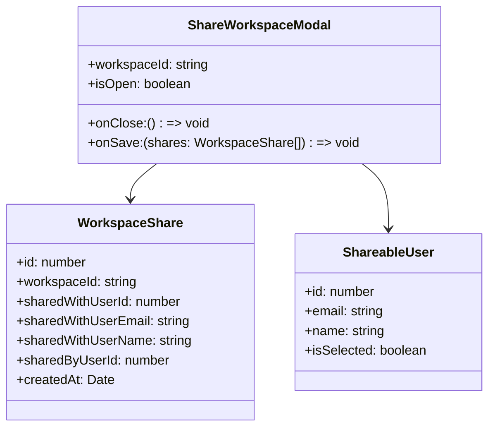
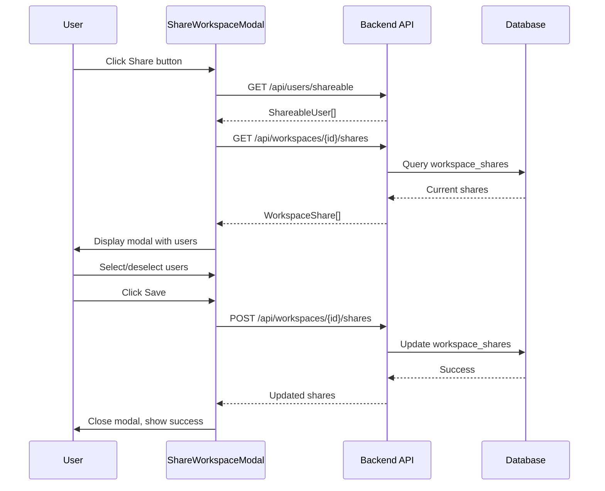

# Share Workspace User Selection

## Metadata

- **Name**: Share Workspace User Selection
- **Type**: Enabler
- **ID**: ENB-260201
- **Capability ID**: CAP-931847
- **Owner**: Development Team
- **Status**: Ready for Analysis
- **Approval**: Pending
- **Priority**: High
- **Analysis Review**: Required
- **Code Review**: Required

## Technical Overview

### Purpose

Replace the current binary share/unshare toggle with a user selection modal that allows workspace owners to selectively share their workspace with specific users in the system. This enables granular access control where owners can choose exactly who has access to their workspace.

### Architecture Fit

This enabler enhances the existing Workspace Sharing (ENB-931850) functionality and integrates with:
- Workspace Management capability (CAP-931847)
- Authentication System (ENB-729481) for user listing
- Workspace Context Management (ENB-931851) for state updates
- Real-Time Collaboration (CAP-Real-Time Collaboration) for sync

### Current vs. New Behavior

| Aspect | Current | New |
|--------|---------|-----|
| Share Action | Toggle isShared boolean | Open modal with user selection |
| User Selection | None (all-or-nothing) | Multi-select from user list |
| Permission Model | Binary (shared/not shared) | Per-user access grants |
| Storage | localStorage only | Database-persisted + localStorage cache |
| Visibility | Everyone or no one | Specific users only |

---

## Functional Requirements

| ID | Name | Requirement | Priority | Status | Approval |
|----|------|-------------|----------|--------|----------|
| FR-260201-001 | Share Modal Trigger | Clicking the Share button opens a modal popup instead of toggling sharing | High | Ready for Design | Pending |
| FR-260201-002 | User List Display | Modal displays a list of all system users (excluding current user) with their name and email | High | Ready for Design | Pending |
| FR-260201-003 | User Selection | User can select/deselect multiple users using checkboxes | High | Ready for Design | Pending |
| FR-260201-004 | Current Shares Display | Modal shows which users already have access with visual indicator | High | Ready for Design | Pending |
| FR-260201-005 | Save Share Permissions | Clicking Save persists the selected users as having access to the workspace | High | Ready for Design | Pending |
| FR-260201-006 | Remove Share Access | Deselecting a previously-shared user revokes their access | High | Ready for Design | Pending |
| FR-260201-007 | Cancel Action | Clicking Cancel closes modal without saving changes | Medium | Ready for Design | Pending |
| FR-260201-008 | User Search/Filter | User can search/filter the user list by name or email | Medium | Ready for Design | Pending |
| FR-260201-009 | Share Count Badge | Workspace card shows count of users it's shared with | Low | Ready for Design | Pending |
| FR-260201-010 | Backend API - List Shares | GET endpoint to retrieve current workspace shares | High | Ready for Design | Pending |
| FR-260201-011 | Backend API - Update Shares | POST endpoint to update workspace share list | High | Ready for Design | Pending |
| FR-260201-012 | Non-Admin User List | Non-admin users can fetch shareable user list (limited fields) | High | Ready for Design | Pending |

---

## Non-Functional Requirements

| ID | Name | Type | Requirement | Priority | Status | Approval |
|----|------|------|-------------|----------|--------|----------|
| NFR-260201-001 | Modal Response Time | Performance | Modal opens within 500ms of button click | High | Ready for Design | Pending |
| NFR-260201-002 | User List Load Time | Performance | User list loads within 1 second | High | Ready for Design | Pending |
| NFR-260201-003 | Data Persistence | Reliability | Share permissions persist across sessions and devices | High | Ready for Design | Pending |
| NFR-260201-004 | Access Control | Security | Only workspace owner can modify share permissions | High | Ready for Design | Pending |
| NFR-260201-005 | User Privacy | Security | User list shows only name and email, no sensitive data | High | Ready for Design | Pending |
| NFR-260201-006 | Accessibility | Usability | Modal is keyboard navigable and screen-reader friendly | Medium | Ready for Design | Pending |

---

## Technical Specifications (Template)

### Component Architecture



### API Specifications (Template)

| Type | Operation | Endpoint | Description | Payload | Response |
|------|-----------|----------|-------------|---------|----------|
| GET | List Shareable Users | /api/users/shareable | Get users available to share with | None | ShareableUser[] |
| GET | Get Workspace Shares | /api/workspaces/{id}/shares | Get current shares for workspace | None | WorkspaceShare[] |
| POST | Update Workspace Shares | /api/workspaces/{id}/shares | Update share list | { userIds: number[] } | WorkspaceShare[] |
| DELETE | Remove Share | /api/workspaces/{id}/shares/{userId} | Remove specific user access | None | { success: boolean } |

### Database Schema (Template)

```sql
CREATE TABLE workspace_shares (
    id SERIAL PRIMARY KEY,
    workspace_id VARCHAR(255) NOT NULL,
    shared_with_user_id INTEGER NOT NULL REFERENCES users(id),
    shared_by_user_id INTEGER NOT NULL REFERENCES users(id),
    created_at TIMESTAMP DEFAULT CURRENT_TIMESTAMP,
    updated_at TIMESTAMP DEFAULT CURRENT_TIMESTAMP,
    UNIQUE(workspace_id, shared_with_user_id)
);

CREATE INDEX idx_workspace_shares_workspace ON workspace_shares(workspace_id);
CREATE INDEX idx_workspace_shares_user ON workspace_shares(shared_with_user_id);
```

### UI Wireframe (Template)

```
+------------------------------------------+
|  Share Workspace: "My Project"      [X]  |
+------------------------------------------+
|                                          |
|  Search users...              [________] |
|                                          |
|  +------------------------------------+  |
|  | [ ] Alice Smith (alice@ex.com)    |  |
|  | [x] Bob Jones (bob@ex.com)    *   |  |
|  | [ ] Carol White (carol@ex.com)    |  |
|  | [x] Dave Brown (dave@ex.com)  *   |  |
|  +------------------------------------+  |
|  * = Currently has access                |
|                                          |
|  Shared with: 2 users                    |
|                                          |
|        [Cancel]        [Save Changes]    |
+------------------------------------------+
```

### Sequence Diagram (Template)



---

## Dependencies

### Upstream Dependencies

| Dependency | Type | Description |
|------------|------|-------------|
| Authentication System | Enabler | User identity and listing |
| Auth Service API | Service | /api/users endpoint |
| Workspace Context | Context | Workspace state management |

### Downstream Dependencies

| Dependency | Type | Description |
|------------|------|-------------|
| Workspace Cards | Component | Will display share count |
| Joined Workspaces | Feature | Uses share data for discovery |

---

## Implementation Notes

### File Locations (Planned)

- **New Component**: `web-ui/src/components/ShareWorkspaceModal.tsx`
- **Context Update**: `web-ui/src/context/WorkspaceContext.tsx`
- **Page Update**: `web-ui/src/pages/Workspaces.tsx`
- **Backend Handler**: `internal/integration/workspace_sharing.go` (new)
- **Database Migration**: `scripts/migrations/add_workspace_shares.sql`
- **API Routes**: `cmd/integration-service/main.go`

### Migration Strategy

1. Add database table for workspace_shares
2. Migrate existing `isShared=true` workspaces to new model (share with all users)
3. Update frontend to use new modal
4. Deprecate but maintain `isShared` field for backwards compatibility

---

## Test Scenarios

| ID | Scenario | Given | When | Then |
|----|----------|-------|------|------|
| TS-260201-001 | Open share modal | User is on Workspaces page with owned workspace | User clicks Share button | Modal opens with user list |
| TS-260201-002 | Select users to share | Modal is open with user list | User selects 2 users and clicks Save | Workspace is shared with those 2 users |
| TS-260201-003 | Remove shared user | Workspace shared with 3 users | User deselects 1 user and saves | Access revoked for that user |
| TS-260201-004 | Cancel without saving | User has made selections | User clicks Cancel | Modal closes, no changes saved |
| TS-260201-005 | Search users | Modal open with 10+ users | User types in search box | List filters to matching users |
| TS-260201-006 | Non-owner cannot share | User views joined workspace | User looks for Share button | No Share button visible |

---

## Approval History

| Date | Stage | Decision | By | Feedback |
|------|-------|----------|-----|----------|
| 2026-01-02 | Intent | Pending | - | Awaiting approval |

---

## Open Questions

1. **Permission Levels**: Should we support view/edit/manage levels, or just binary access?
2. **Notifications**: Should shared users receive notifications when access is granted/revoked?
3. **Share Links**: Should we support shareable links in addition to user selection?
4. **Batch Operations**: Should owners be able to share with "all users" as a quick action?

---

**Document Version**: 1.0
**Created**: 2026-01-02
**Last Updated**: 2026-01-02
**Author**: Development Team
